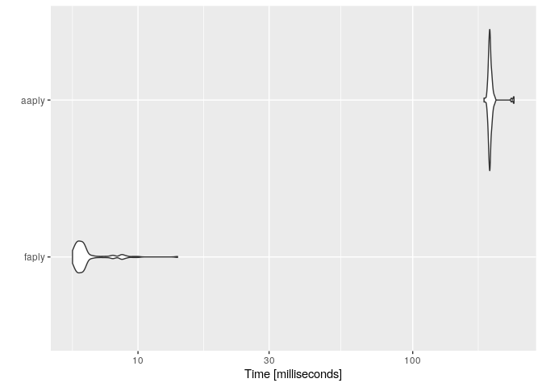

<!-- README.md is generated from README.Rmd. Please edit that file -->
aaply2
======

<!-- badges: start -->
<!-- badges: end -->
The goal of aaply2 is to accelerate `plyr::aaply(,.drop=F)`

Installation
------------

You can install the released version of aaply2 from [CRAN](https://CRAN.R-project.org) with:

``` r
install.packages("aaply2")
```

And the development version from [GitHub](https://github.com/) with:

``` r
# install.packages("devtools")
devtools::install_github("hurrialice/faply")
```

Example
-------

`fast_aaply` can give the same structure as `aaply`.

``` r
library(aaply2)
library(plyr)
library(magrittr)

dims <- c(2,10,2,5,1)
arr <- array(1:prod(dims), dims, lapply(dims, function(d) 1:d))
fast_aaply(arr, c(2,4,3), cumsum) %>% str
#>  int [1:10, 1:5, 1:2, 1:2] 1 3 5 7 9 11 13 15 17 19 ...
#>  - attr(*, "dimnames")=List of 4
#>   ..$ : chr [1:10] "1" "2" "3" "4" ...
#>   ..$ : chr [1:5] "1" "2" "3" "4" ...
#>   ..$ : chr [1:2] "1" "2"
#>   ..$ : NULL
plyr::aaply(arr, c(2,4,3), cumsum) %>% str
#>  int [1:10, 1:5, 1:2, 1:2] 1 3 5 7 9 11 13 15 17 19 ...
#>  - attr(*, "dimnames")=List of 4
#>   ..$ X1: chr [1:10] "1" "2" "3" "4" ...
#>   ..$ X2: chr [1:5] "1" "2" "3" "4" ...
#>   ..$ X3: chr [1:2] "1" "2"
#>   ..$   : chr [1:2] "1" "2"
```

But much faster -

``` r
library(microbenchmark)


dims <- dims*3
arr <- array(runif(prod(dims)), dims, lapply(dims, function(d) 1:d))

check_val <- function(values){
    tol <- 1e-12
    max(values[[1]] - values[[2]]) < tol
}


mbm <- microbenchmark(
    "faply"={fast_aaply(arr, c(2,4,3), cumsum)},
    "aaply"={plyr::aaply(arr, c(2,4,3), cumsum)} ,
    check = check_val
)


library(ggplot2)
autoplot(mbm)
#> Coordinate system already present. Adding new coordinate system, which will replace the existing one.
```


